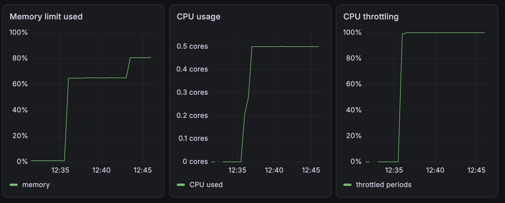

# Лаба 1

# Часть 0 -- Сервис API

Запуск:

```bash
cd lab1/api
go run .
```

```bash
curl http://localhost:8080/health       # проверка здоровья: ok
curl 'http://localhost:8080/eat?mb=100' # выделить и удерживать 100 MiB памяти
curl http://localhost:8080/burn         # бесконечно нагружать одно ядро CPU
```

# Часть 1 -- Что у нас там по процессу

Зафиксировали PID, PPID, UID. Так как у нас пока никакой изолияции нашего namespace нет, то наш процесс решил его разделить с неймспейсом shell. На этом все!

```bash
qerenny@containers:~/containers-labs/lab1/api$ pgrep -a -x api
23775 ./api

qerenny@containers:~/containers-labs/lab1/api$ ls -l /proc/$$/ns/
total 0
lrwxrwxrwx 1 qerenny qerenny 0 Sep 17 10:38 cgroup -> 'cgroup:[4026531835]'
lrwxrwxrwx 1 qerenny qerenny 0 Sep 17 10:36 ipc -> 'ipc:[4026531839]'
lrwxrwxrwx 1 qerenny qerenny 0 Sep 17 10:36 mnt -> 'mnt:[4026531841]'
lrwxrwxrwx 1 qerenny qerenny 0 Sep 17 10:36 net -> 'net:[4026531840]'
lrwxrwxrwx 1 qerenny qerenny 0 Sep 17 10:36 pid -> 'pid:[4026531836]'  
  
qerenny@containers:~/containers-labs/lab1/api$ ls -l /proc/23775/ns/
total 0
lrwxrwxrwx 1 qerenny qerenny 0 Sep 17 10:47 cgroup -> 'cgroup:[4026531835]'
lrwxrwxrwx 1 qerenny qerenny 0 Sep 17 10:36 ipc -> 'ipc:[4026531839]'
lrwxrwxrwx 1 qerenny qerenny 0 Sep 17 10:36 mnt -> 'mnt:[4026531841]'
lrwxrwxrwx 1 qerenny qerenny 0 Sep 17 10:36 net -> 'net:[4026531840]'
lrwxrwxrwx 1 qerenny qerenny 0 Sep 17 10:36 pid -> 'pid:[4026531836]'
```

# Часть 2 -- Поехали пляски -- свой неймспейс

Так, первым делом меня послали и сказали что нельзя мапиться:

```bash
qerenny@containers:~/containers-labs/lab1/api$ unshare -Ur bash
unshare: write failed /proc/self/uid_map: Operation not permitted
```

Так как машинка учебная могу себе позволить снять защиту и говорю, что не надо мне тут запрещать ничего!

```bash
sudo sysctl -w kernel.apparmor_restrict_unprivileged_userns=0
```

Успешно договорившись с машинкой о наших отношениях, могу с гордостью заявить, что мы сделали неймспейс, где свой pid, mount, net, uts, ipc и user.

```bash
#родительский
qerenny@containers:~/containers-labs$ ps -o pid,ppid,user,uid,stat,comm,args -p 37506
    PID    PPID USER       UID STAT COMMAND         COMMAND
  37506   37505 qerenny   1000 Sl+  api             ./api

qerenny@containers:~/containers-labs$ hostname
containers

qerenny@containers:~/containers-labs$ readlink /proc/self/ns/*
cgroup:[4026531835]
ipc:[4026531839]
mnt:[4026531841]
net:[4026531840]
pid:[4026531836]
pid:[4026531836]
time:[4026531834]
time:[4026531834]
user:[4026531837]
uts:[4026531838]

qerenny@containers:~/containers-labs$ sudo nsenter -t 37506   --user   --mount   --net   --uts   --ipc   --pid   bash

#дочерний
root@containers:~/containers-labs/lab1/api# id && echo $$
uid=0(root) gid=0(root) groups=0(root),65534(nogroup)
1

root@containers:~/containers-labs/lab1/api# hostname help-pls
root@containers:~/containers-labs/lab1/api# hostname
help-pls

root@containers:~/containers-labs/lab1/api# ip addr
1: lo: <LOOPBACK> mtu 65536 qdisc noop state DOWN group default qlen 1000
    link/loopback 00:00:00:00:00:00 brd 00:00:00:00:00:00
root@containers:~/containers-labs/lab1/api# ip route
root@containers:~/containers-labs/lab1/api# ip link
1: lo: <LOOPBACK> mtu 65536 qdisc noop state DOWN mode DEFAULT group default qlen 1000
    link/loopback 00:00:00:00:00:00 brd 00:00:00:00:00:00
    
root@containers:~/containers-labs/lab1/api# exec ./api 
2026/09/17 12:06:17 api listening on :8080

root@help-pls:/# echo $$ && \
readlink /proc/self/ns/pid && \
readlink /proc/1/ns/pid && \
ps -ef && \
19
pid:[4026532323]
pid:[4026532323]
UID          PID    PPID  C STIME TTY          TIME CMD
root           1       0  0 12:04 pts/0    00:00:00 ./api
root          19       0  0 12:11 pts/5    00:00:00 bash
root          24      19  0 12:12 pts/5    00:00:00 ps -ef


root@help-pls:/# readlink /proc/self/ns/*
cgroup:[4026531835]
ipc:[4026532322]
mnt:[4026532318]
net:[4026532324]
pid:[4026532323]
pid:[4026532323]
time:[4026531834]
time:[4026531834]
user:[4026532317]
uts:[4026532321]
```

# Часть 3 -- Пляски это мягко сказано -- cgroups

В общем здесь мы сначала для души посмотрим в каком скоупе находится наш shell.

```bash
qerenny@containers:~/containers-labs/lab1/api$ mount | grep 'cgroup'
cgroup2 on /sys/fs/cgroup type cgroup2 (rw,nosuid,nodev,noexec,relatime,nsdelegate,memory_recursiveprot)

qerenny@containers:~/containers-labs/lab1/api$ cat /proc/self/cgroup 
0::/user.slice/user-1000.slice/session-125.scope
```

Потом поймем, что, чтобы не нарушать правило no internal processes и не ломать дерево бедного systemd, мы создадим свой скоуп под владением systemd, но управление заберем в свои ручки.

```bash
qerenny@containers:~/containers-labs/lab1/api$ systemd-run --user --scope \
> --unit=lab1.scope \
> --property=Delegate=yes \
> --property=DelegateSubgroup=manager \
> bash
Running as unit: lab1.scope; invocation ID: 22ca4469e21f4a2abcd4cf299bc60291

qerenny@containers:~/containers-labs/lab1/api$ cat /proc/self/cgroup 
0::/user.slice/user-1000.slice/user@1000.service/app.slice/lab1.scope
qerenny@containers:~/containers-labs/lab1/api$ BASE=/sys/fs/cgroup/user.slice/user-1000.slice/user@1000.service/app.slice/lab1.scope
```

Так как план не всегда работает как швейцарские часы и у нас subgroup отработал не так как нужно, мы сами создадим руками manager, но зато мы убедимся что мы имеем права что либо делать, ну и переместим наш bash процесс туда, где он должен был быть.

```bash
qerenny@containers:~/containers-labs/lab1/api$ mkdir "$BASE/manager"
qerenny@containers:~/containers-labs/lab1/api$ echo $$ > "$BASE/manager/cgroup.procs"
qerenny@containers:~/containers-labs/lab1/api$ cat /proc/self/cgroup
0::/user.slice/user-1000.slice/user@1000.service/app.slice/lab1.scope/manager 
#это победа друзья, мы могли с этим справиться еще на предыдущем шаге, но чего же унывать то
```

Теперь дадим нашим дочерним процессам создаваться с нашими контроллерами cpu, memory и pids. И создадим нашу целевую api со своими правилами.

```bash
qerenny@containers:~/containers-labs/lab1/api$ cat $BASE/cgroup.controllers
cpu memory pids
qerenny@containers:~/containers-labs/lab1/api$ echo '+cpu +memory +pidse' > "$BASE/cgroup.subtree_control"
bash: echo: write error: Invalid argument #ну не без урода в семье.
qerenny@containers:~/containers-labs/lab1/api$ echo '+cpu +memory +pids' > "$BASE/cgroup.subtree_control"
#так лучше

qerenny@containers:~/containers-labs/lab1/api$ mkdir $BASE/api
qerenny@containers:~/containers-labs/lab1/api$ ls $BASE/api
cgroup.controllers      cgroup.stat             cpu.stat         memory.events        memory.peak          memory.swap.peak
cgroup.events           cgroup.subtree_control  cpu.stat.local   memory.events.local  memory.pressure      memory.zswap.current
cgroup.freeze           cgroup.threads          cpu.uclamp.max   memory.high          memory.reclaim       memory.zswap.max
cgroup.kill             cgroup.type             cpu.uclamp.min   memory.low           memory.stat          memory.zswap.writeback
cgroup.max.depth        cpu.idle                cpu.weight       memory.max           memory.swap.current  pids.current
cgroup.max.descendants  cpu.max                 cpu.weight.nice  memory.min           memory.swap.events   pids.events
cgroup.pressure         cpu.max.burst           io.pressure      memory.numa_stat     memory.swap.high     pids.max
cgroup.procs            cpu.pressure            memory.current   memory.oom.group     memory.swap.max      pids.peak

qerenny@containers:~/containers-labs/lab1/api$ echo 32M > "$BASE/api/memory.max"
qerenny@containers:~/containers-labs/lab1/api$ echo 0   > "$BASE/api/memory.swap.max"  # деремся за свап
qerenny@containers:~/containers-labs/lab1/api$ echo '50000 100000' > "$BASE/api/cpu.max" # половина цпу (вроде)
qerenny@containers:~/containers-labs/lab1/api$ echo 20 > "$BASE/api/pids.max" # да, захотелось 20
```

Откроем дочерку bash, перекинем его в api/cgroup.procs, ну и запустим ./api.

```bash
qerenny@containers:~/containers-labs/lab1/api$ bash
qerenny@containers:~/containers-labs/lab1/api$ echo $$ > $BASE/api/cgroup.procs
qerenny@containers:~/containers-labs/lab1/api$ cat $BASE/api/cgroup.procs
54509
55310
qerenny@containers:~/containers-labs/lab1/api$ echo $$
54509
qerenny@containers:~/containers-labs/lab1/api$ exec ./api
2026/09/17 14:58:26 api listening on :8080

# на этом моменте я потерял где я и в каком процессе нахожусь и все слома😭. теперь все заново..........
# сделаем так на всякий nohup sleep infinity >/dev/null 2>&1 &

qerenny@containers:~/containers-labs/lab1/api$ echo $$
58306
qerenny@containers:~/containers-labs/lab1/api$ exec ./api
2026/09/17 15:19:18 api listening on :8080  
...  
  
qerenny@containers:~/containers-labs$ ps -o pid,ppid,comm,args -p 58306
    PID    PPID COMMAND         COMMAND
  58306   57050 api             ./api
  
#держимся🫠
```

Ну давайте теперь попробуем загасить его намеренно через память.

```bash
qerenny@containers:~/containers-labs$ curl http://localhost:8080/health
ok
qerenny@containers:~/containers-labs$ curl http://localhost:8080/eat?mb=100
curl: (52) Empty reply from server

    # тем временем в другой вселенной 
    qerenny@containers:~/containers-labs/lab1/api$ exec ./api
    2026/09/17 15:19:18 api listening on :8080
    Killed
    
qerenny@containers:~/containers-labs/lab1/api$ cat $BASE/api/memory.peak
33554432
qerenny@containers:~/containers-labs/lab1/api$ cat $BASE/api/memory.events
low 0
high 0
max 37
oom 1 # поймали гада
oom_kill 1
oom_group_kill 0
qerenny@containers:~/containers-labs/lab1/api$ cat $BASE/api/memory.current
0
qerenny@containers:~/containers-labs/lab1/api$ cat $BASE/api/cgroup.events
populated 0
frozen 0
```

Теперь через цпу троттлинг.
```bash
# на всякий уберем с памяти ограничение
qerenny@containers:~/containers-labs/lab1/api$ echo max > "$BASE/api/memory.max"
qerenny@containers:~/containers-labs/lab1/api$ cat "$BASE/api/cpu.stat"
usage_usec 53095
user_usec 12744
system_usec 40350
core_sched.force_idle_usec 0
nr_periods 23
nr_throttled 0
throttled_usec 0
nr_bursts 0
burst_usec 0

    # пошла жара
    watch -n 1 cat "/sys/fs/cgroup/user.slice/user-1000.slice/user@1000.service/app.slice/lab1.sco
pe/api/cpu.stat"
    Every 1.0s: cat /sys/fs/cgroup/user.slice/user-1000.slice/user@1000.service/app.slice/lab1....  containers: Thu Sep 17 15:46:54 2026
    usage_usec 40002110
    user_usec 39669298
    system_usec 332812
    core_sched.force_idle_usec 0
    nr_periods 859
    nr_throttled 796
    throttled_usec 42318778
    nr_bursts 0
    burst_usec 0

    
```

А теперь через бомбу.

```bash
qerenny@containers:~/containers-labs$ echo max > "$BASE/api/cpu.max" # на всякий
qerenny@containers:~/containers-labs$ cat "$BASE/api/pids.current" \
cat "$BASE/api/pids.max" \
cat "$BASE/api/pids.events"
6
20
max 0

# чтобы ограничение работало нам нужно сделать новый шелл в это же api cgroup
qerenny@containers:~/containers-labs$ echo $$ | sudo tee "$BASE/api/cgroup.procs" 
64305
qerenny@containers:~/containers-labs$ stress-ng --fork 100 --timeout 10s
stress-ng: info:  [65727] setting to a 10 secs run per stressor
stress-ng: info:  [65727] dispatching hogs: 100 fork

    #наблюдаем
    qerenny@containers:~/containers-labs$ watch -n 0.5 cat "$BASE/api/pids.current"
    Every 0.5s: cat /sys/fs/cgroup/user.slice/user-1000.slice/user@1000.service/app.slice/lab1....  
    containers: Thu Sep 17 16:00:02 2026
    20
    
    Every 0.5s: cat /sys/fs/cgroup/user.slice/user-1000.slice/user@1000.service/app.slice/lab1....
    containers: Thu Sep 17 16:00:25 2026
    20
    
    qerenny@containers:~/containers-labs$ cat "$BASE/api/pids.events"
    max 290290
    qerenny@containers:~/containers-labs$ cat "$BASE/api/pids.peak"
    20
    # в общем можем наблюдать ограничение
    

```

# Часть 4 -- Права, права, права -- а что это по сути своей?

## capabilities

Ну ну давайте снова неймспейс сделаем че бы нет. Там пойдем наши права кашмарить. Начнем с capabilities.

```bash
qerenny@containers:~/containers-labs$ unshare \
  --user \
  --map-root-user \
  --mount \
  --uts \
  --ipc \
  --pid \
  --net \
  --fork \
  --mount-proc \
  bash  
  
# посмотрим че мы могём... а много мы могём
root@containers:~/containers-labs# capsh --print
Current: =ep
Bounding set =cap_chown,cap_dac_override,cap_dac_read_search,cap_fowner,cap_fsetid,cap_kill,cap_setgid,cap_setuid,cap_setpcap,cap_linux_immutable,cap_net_bind_service,cap_net_broadcast,cap_net_admin,cap_net_raw,cap_ipc_lock,cap_ipc_owner,cap_sys_module,cap_sys_rawio,cap_sys_chroot,cap_sys_ptrace,cap_sys_pacct,cap_sys_admin,cap_sys_boot,cap_sys_nice,cap_sys_resource,cap_sys_time,cap_sys_tty_config,cap_mknod,cap_lease,cap_audit_write,cap_audit_control,cap_setfcap,cap_mac_override,cap_mac_admin,cap_syslog,cap_wake_alarm,cap_block_suspend,cap_audit_read,cap_perfmon,cap_bpf,cap_checkpoint_restore
Ambient set =
Current IAB: 
Securebits: 00/0x0/1'b0 (no-new-privs=0)
 secure-noroot: no (unlocked)
 secure-no-suid-fixup: no (unlocked)
 secure-keep-caps: no (unlocked)
 secure-no-ambient-raise: no (unlocked)
uid=0(root) euid=0(root)
gid=0(root)
groups=65534(nogroup),65534(nogroup),65534(nogroup),65534(nogroup),65534(nogroup),65534(nogroup),0(root)
Guessed mode: HYBRID (4)

root@containers:~/containers-labs# setpriv \
  --bounding-set=-all \
  --inh-caps=-all \
  --ambient-caps=-all \
  --no-new-privs \
  bash --noprofile --norc


  
# так букв здесь много, но кажется мы ничего не могём 
bash-5.2# 
bash-5.2# capsh --print
Current: =
Bounding set =
Ambient set =
Current IAB: !cap_chown,!cap_dac_override,!cap_dac_read_search,!cap_fowner,!cap_fsetid,!cap_kill,!cap_setgid,!cap_setuid,!cap_setpcap,!cap_linux_immutable,!cap_net_bind_service,!cap_net_broadcast,!cap_net_admin,!cap_net_raw,!cap_ipc_lock,!cap_ipc_owner,!cap_sys_module,!cap_sys_rawio,!cap_sys_chroot,!cap_sys_ptrace,!cap_sys_pacct,!cap_sys_admin,!cap_sys_boot,!cap_sys_nice,!cap_sys_resource,!cap_sys_time,!cap_sys_tty_config,!cap_mknod,!cap_lease,!cap_audit_write,!cap_audit_control,!cap_setfcap,!cap_mac_override,!cap_mac_admin,!cap_syslog,!cap_wake_alarm,!cap_block_suspend,!cap_audit_read,!cap_perfmon,!cap_bpf,!cap_checkpoint_restore
Securebits: 00/0x0/1'b0 (no-new-privs=1)
 secure-noroot: no (unlocked)
 secure-no-suid-fixup: no (unlocked)
 secure-keep-caps: no (unlocked)
 secure-no-ambient-raise: no (unlocked)
uid=0(root) euid=0(root)
gid=0(root)
groups=65534(nogroup),65534(nogroup),65534(nogroup),65534(nogroup),65534(nogroup),65534(nogroup),0(root)
Guessed mode: HYBRID (4)

# а че это у нас не выходит
bash-5.2# hostname 
containers
bash-5.2# hostname cc
hostname: you must be root to change the host name

# а че
bash-5.2# getcap /usr/bin/ping
/usr/bin/ping cap_net_raw=ep
bash-5.2# ping 8.8.8.8
bash: /usr/bin/ping: Operation not permitted

# ааа, так вот че, мыж бесправные
bash-5.2# grep CapBnd /proc/$$/status
CapBnd: 0000000000000000
# да и у нас повышений привелегий запрещено, 
# поэтому бедолага пинг ничего не может от слова совсем
# (даже если бы ему что то и можно было разрешено получить)
NoNewPrivs:     1
```

## Seccomp

Seccomp-профиль работает по denylist-модели:
- все системные вызовы разрешены по умолчанию;
- syscall uname блокируется;
- перед загрузкой фильтра no_new_privs;
- после загрузки фильтра launcher через execvp заменяется целевой программой.

Это моджно увидеть по этому отрывку файла seccomp-launcher.c:

```c
prctl(PR_SET_NO_NEW_PRIVS, 1, 0, 0, 0);

filter = seccomp_init(SCMP_ACT_ALLOW);

seccomp_rule_add(
    filter,
    SCMP_ACT_ERRNO(EPERM),
    SCMP_SYS(uname),
    0
);

seccomp_load(filter);

execvp(argv[1], &argv[1]);
```

SCMP_ACT_ALLOW задаёт разрешение всех syscall по умолчанию. Для uname добавляется отдельное правило, возвращающее EPERM. После seccomp_load() фильтр загружается в ядро. execvp() заменяет launcher целевой программой, которая наследует установленный seccomp-фильтр.

Увидеть работу обычных программ можно на:

```bash
qerenny@containers:~/containers-labs$  ./lab1/seccomp-launcher /bin/true
echo $?
0
```

Посмотрим на заблокированный uname:

```bash
qerenny@containers:~/containers-labs$ ./lab1/seccomp-launcher bash
qerenny@??host??:~/containers-labs$ uname -a
uname: cannot get system name: Operation not permitted
```

Его работу можно увидеть сразу по `??host??` система просто не смогла получить имя хоста.

Чтобы было совсем честно проверим так:

```bash
qerenny@containers:~/containers-labs$ ./lab1/seccomp-launcher bash --noprofile --norc
bash-5.2$ uname -a
uname: cannot get system name: Operation not permitted
bash-5.2$ echo hello
hello
bash-5.2$ grep -E 'Seccomp|NoNewPrivs' /proc/$$/status
NoNewPrivs:     1
Seccomp:        2
Seccomp_filters:        1
bash-5.2$ pwd
/home/qerenny/containers-labs
bash-5.2$ exec ./lab1/api/api 
2026/09/18 10:35:48 api listening on :8080
    
    qerenny@containers:~/containers-labs$ curl http://localhost:8080/health
    ok
        
    qerenny@containers:~/containers-labs$ ps aux | grep [a]pi
    qerenny   382079  0.0  0.0 1599944 6356 pts/2    Sl+  10:47   0:00 ./lab1/api/api
    qerenny@containers:~/containers-labs$ cat /proc/382079/status | grep -E 'Seccomp|NoNewPrivs'
    NoNewPrivs:     1
    Seccomp:        2
    Seccomp_filters:        1
```

#  Часть 5 -- Сравним докер и наш скрипт

Ну что, руками мы уже собрали почти контейнер. Теперь посмотрим насколько Docker делает то же самое, только без танцев с бубном.

## Наш `mydocker.sh`

Запускаем:

```bash
qerenny@containers:~/containers-labs$ ./lab1/mydocker.sh
Running as unit: lab1-386940.scope; invocation ID: 668f04cb6afb48049c1eb44f998ee92d
cgroup: /sys/fs/cgroup/user.slice/user-1000.slice/user@1000.service/app.slice/lab1-386940.scope
memory.max=33554432
cpu.max=50000 100000
pids.max=20
cgroup:
0::/user.slice/user-1000.slice/user@1000.service/app.slice/lab1-386940.scope/api
pid=1
uid=0
hostname=lab1-api
2026/09/18 11:33:29 api listening on :8080

api host pid: 387049
health:
sudo nsenter -t 387049 --net curl http://127.0.0.1:8080/health
```

Проверим, что он вообще жив:

```bash
qerenny@containers:~/containers-labs$ sudo nsenter -t 387049 --net curl http://127.0.0.1:8080/health
ok
```

Ну и права:

```bash
qerenny@containers:~/containers-labs$ grep -E '^(Cap|NoNewPrivs|Seccomp)' /proc/387049/status
CapInh: 0000000000000000
CapPrm: 0000000000000000
CapEff: 0000000000000000
CapBnd: 0000000000000000
CapAmb: 0000000000000000
NoNewPrivs:     1
Seccomp:        2
Seccomp_filters:        1
```

В общем capabilities нет, `no_new_privs` есть, seccomp тоже на месте.

## А теперь Docker

Запускаем тот же сервис примерно с теми же ограничениями:

```bash
qerenny@containers:~/containers-labs$ docker run --rm \
  --name=lab1-api-docker \
  --memory=32m \
  --memory-swap=32m \
  --cpus=0.5 \
  --pids-limit=20 \
  --cap-drop=ALL \
  --security-opt=no-new-privileges \
  --hostname=lab1-api \
  --publish=8081:8080 \
  --mount type=bind,source="$PWD/lab1/api/api",target=/api,readonly \
  ubuntu:24.04 \
  /api
2026/09/18 11:45:45 api listening on :8080
```

Посмотрим PID контейнера:

```bash
qerenny@containers:~/containers-labs$ PID=$(sudo docker inspect --format '{{.State.Pid}}' lab1-api-docker)
qerenny@containers:~/containers-labs$ echo "$PID"
390939
```

Проверим hostname и `uname`:

```bash
qerenny@containers:~/containers-labs$ sudo docker exec lab1-api-docker id
uid=0(root) gid=0(root) groups=0(root)

qerenny@containers:~/containers-labs$ sudo docker exec lab1-api-docker hostname
lab1-api

qerenny@containers:~/containers-labs$ sudo docker exec lab1-api-docker uname -a
Linux lab1-api 6.8.0-139-generic #139-Ubuntu SMP PREEMPT_DYNAMIC Sat Aug 1 03:52:05 UTC 2026 x86_64 x86_64 x86_64 GNU/Linux
```

Права:

```bash
qerenny@containers:~/containers-labs$ grep -E '^(Cap|NoNewPrivs|Seccomp)' "/proc/$PID/status"
CapInh: 0000000000000000
CapPrm: 0000000000000000
CapEff: 0000000000000000
CapBnd: 0000000000000000
CapAmb: 0000000000000000
NoNewPrivs:     1
Seccomp:        2
Seccomp_filters:        1
```

Ну и cgroup:

```bash
qerenny@containers:~/containers-labs$ CG_PATH="/sys/fs/cgroup$(awk -F: '$1 == 0 {print $3}' "/proc/$PID/cgroup")"

qerenny@containers:~/containers-labs$ cat "$CG_PATH/memory.max"
33554432

qerenny@containers:~/containers-labs$ cat "$CG_PATH/memory.swap.max"
0

qerenny@containers:~/containers-labs$ cat "$CG_PATH/cpu.max"
50000 100000

qerenny@containers:~/containers-labs$ cat "$CG_PATH/pids.max"
20
```

То есть лимиты получились буквально те же.

## Ну и в чем тогда разница?

По базе всё совпало: namespaces, cgroups, capabilities, `no_new_privs`, seccomp и hostname.

Но наш скрипт совсем минимальный.

С сетью мы только сделали отдельный net namespace и подняли `lo`, поэтому до API приходится лезть через:

```bash
qerenny@containers:~/containers-labs$ sudo nsenter -t 387049 --net curl http://127.0.0.1:8080/health
ok
```

Docker же сам сделал сеть и пробросил:

```text
8081 -> 8080
```

Ещё у нас есть mount namespace, но отдельного rootfs мы не собирали. Docker же запускает процесс внутри файловой системы образа `ubuntu:24.04`.

Seccomp тоже отличается: в нашем launcher мы специально запретили `uname`, а в Docker:

```bash
qerenny@containers:~/containers-labs$ sudo docker exec lab1-api-docker uname -a
Linux lab1-api 6.8.0-139-generic #139-Ubuntu SMP PREEMPT_DYNAMIC Sat Aug 1 03:52:05 UTC 2026 x86_64 x86_64 x86_64 GNU/Linux
```

Ну и Docker сверху сам занимается lifecycle, сетью, rootfs, пробросом портов и уборкой после `--rm`.

В общем мы руками сделали и потратили время на то что Docker умеет собирать сам без нас за секунду.

# Часть 6 -- образы


## Сначала жирный вариант

Для начала просто берём Go-образ, собираем бинарник прямо внутри него и там же оставляем.

`lab1/api/Dockerfile.single`:

```dockerfile
FROM golang:1.22.12-bookworm

WORKDIR /src

COPY go.mod ./
COPY . .

RUN go build -o api .

CMD ["/src/api"]
```

Чтобы случайно не протащить внутрь уже собранный на хосте бинарник:

```text
# .dockerignore
api
```

Собираем и сразу смотрим что получилось:

```bash
qerenny@containers:~/containers-labs$ sudo docker build \
  -f lab1/api/Dockerfile.single \
  -t lab1-api:single \
  lab1/api
[+] Building 35.9s (10/10) FINISHED

qerenny@containers:~/containers-labs$ sudo docker image ls lab1-api:single
IMAGE             ID             DISK USAGE   CONTENT SIZE
lab1-api:single   78884d039461       1.31GB          319MB
```

Ну и получился слегка упитанный образ.

Посмотрим откуда весь этот вес:

```bash
qerenny@containers:~/containers-labs$ sudo docker history lab1-api:single
IMAGE          CREATED BY                                      SIZE
78884d039461   CMD ["/src/api"]                                0B
<missing>      RUN /bin/sh -c go build -o api .                77.9MB
<missing>      COPY . .                                        24.6kB
<missing>      COPY go.mod ./                                  12.3kB
<missing>      WORKDIR /src                                    8.19kB
...
<missing>      COPY /target/ /                                 265MB
<missing>      RUN ... apt-get ...                             267MB
<missing>      RUN ... apt-get ...                             194MB
<missing>      RUN ... apt-get ...                             52.3MB
<missing>      debian bookworm                                 133MB
```

Ну да, вместе с нашим маленьким `api` внутрь приехал весь Go toolchain и Debian.

Проверяем что оно вообще живёт:

```bash
qerenny@containers:~/containers-labs$ sudo docker run --rm \
  --name lab1-api-single \
  -p 8081:8080 \
  lab1-api:single
2026/09/18 12:18:35 api listening on :8080

qerenny@containers:~/containers-labs$ curl http://127.0.0.1:8081/health
ok
```

## А теперь без лишнего — multi-stage

Соберём бинарник в одном stage, а в финальный образ положим только его.

`lab1/api/Dockerfile.multi`:

```dockerfile
FROM golang:1.22.12-bookworm AS builder

WORKDIR /src

COPY go.mod ./
COPY . .

RUN CGO_ENABLED=0 go build -o api .

FROM scratch

COPY --from=builder /src/api /api

ENTRYPOINT ["/api"]
```

Собираем и смотрим размер:

```bash
qerenny@containers:~/containers-labs$ sudo docker build \
  -f lab1/api/Dockerfile.multi \
  -t lab1-api:multi \
  lab1/api
[+] Building 10.8s (11/11) FINISHED

qerenny@containers:~/containers-labs$ sudo docker image ls lab1-api:multi
IMAGE            ID             DISK USAGE   CONTENT SIZE
lab1-api:multi   f55e6d1533e1       11.1MB         4.04MB
```

Было `1.31GB`, стало `11.1MB`. Ну тут без комментариев.

История слоёв тоже внезапно стала очень короткой:

```bash
qerenny@containers:~/containers-labs$ sudo docker history lab1-api:multi
IMAGE          CREATED BY                      SIZE
f55e6d1533e1   ENTRYPOINT ["/api"]             0B
<missing>      COPY /src/api /api              7.02MB
```

То есть в финальном образе по сути только бинарник и настройка запуска.

Проверяем:

```bash
qerenny@containers:~/containers-labs$ sudo docker run --rm \
  -p 8081:8080 \
  lab1-api:multi
2026/09/18 12:24:25 api listening on :8080
```

## А что там с кэшем

Собираем тот же multi-stage ещё раз ничего не меняя:

```bash
qerenny@containers:~/containers-labs$ sudo docker build \
  -f lab1/api/Dockerfile.multi \
  -t lab1-api:multi \
  lab1/api
[+] Building 0.7s (11/11) FINISHED
 => CACHED [builder 2/5] WORKDIR /src
 => CACHED [builder 3/5] COPY go.mod ./
 => CACHED [builder 4/5] COPY . .
 => CACHED [builder 5/5] RUN CGO_ENABLED=0 go build -o api .
 => CACHED [stage-1 1/1] COPY --from=builder /src/api /api
```

То есть если входные данные слоя не менялись, Docker просто берёт его из cache и не выполняет заново.

## Данные внутри контейнера — вещь временная

Теперь проверим что будет с обычным файлом внутри контейнера.

```bash
qerenny@containers:~/containers-labs$ sudo docker run -d \
  --name lab1-data \
  lab1-api:single
6d5f9a5c43104e4e1c4bd4ae6a0a90119c8fee71ee145bb7286606b87b3f2e75

qerenny@containers:~/containers-labs$ sudo docker exec lab1-data \
  sh -c 'echo hello > /tmp/test.txt'

qerenny@containers:~/containers-labs$ sudo docker exec lab1-data \
  cat /tmp/test.txt
hello
```

Удаляем контейнер и создаём новый:

```bash
qerenny@containers:~/containers-labs$ sudo docker rm -f lab1-data
lab1-data

qerenny@containers:~/containers-labs$ sudo docker run -d \
  --name lab1-data \
  lab1-api:single
60f60814ca447755255e164cf1ae1c0e5be30678ed2a0946d1b1bf5492deb10b

qerenny@containers:~/containers-labs$ sudo docker exec lab1-data \
  cat /tmp/test.txt
cat: /tmp/test.txt: No such file or directory
```

То есть writable layer умер вместе со старым контейнером.

## А теперь с volume

Создаём volume, пишем туда файл, потом пересоздаём контейнер:

```bash
qerenny@containers:~/containers-labs$ sudo docker volume create lab1-data
lab1-data

qerenny@containers:~/containers-labs$ sudo docker run -d \
  --name lab1-volume \
  -v lab1-data:/data \
  lab1-api:single
905344e33bb0a84bf48dcec2adf6026d62a2c19e0d4a54c186c7c406991318dc

qerenny@containers:~/containers-labs$ sudo docker exec lab1-volume \
  sh -c 'echo hello-volume > /data/test.txt'

qerenny@containers:~/containers-labs$ sudo docker rm -f lab1-volume
lab1-volume

qerenny@containers:~/containers-labs$ sudo docker run -d \
  --name lab1-volume \
  -v lab1-data:/data \
  lab1-api:single
157ed08224a9b351f5545d1dbe31c031f175502bb048a514a5c44e1a4fd32981

qerenny@containers:~/containers-labs$ sudo docker exec lab1-volume \
  cat /data/test.txt
hello-volume
```

# Часть 7 -- gVisor -- теперь давайте ещё одно ядро между нами и ядром

Запустим тот же `lab1-api:multi`, но теперь через `runsc`:

```bash
qerenny@containers:~/containers-labs$ sudo docker run --rm \
  --runtime=runsc \
  --name lab1-api-gvisor \
  -p 8081:8080 \
  lab1-api:multi
2026/09/18 12:39:58 api listening on :8080

qerenny@containers:~/containers-labs$ curl http://127.0.0.1:8081/health
ok
```

Ну то есть сервис жив, только runtime у нас теперь уже не обычный `runc`, а `runsc`.

Посмотрим, что там вообще происходит:

```bash
qerenny@containers:~/containers-labs$ sudo docker run --rm \
  --runtime=runsc \
  ubuntu:24.04 \
  dmesg
[sudo] password for qerenny:
[    0.000000] Starting gVisor...
[    0.471395] Letting the watchdogs out...
[    0.598962] Forking spaghetti code...
[    0.951228] Singleplexing /dev/ptmx...
[    1.322209] Adversarially training Redcode AI...
[    1.627695] Rewriting operating system in Javascript...
[    1.940872] Generating random numbers by fair dice roll...
[    1.980556] Constructing home...
[    2.385223] Searching for socket adapter...
[    2.722363] Checking naughty and nice process list...
[    2.884919] Searching for needles in stacks...
[    2.911042] Setting up VFS...
[    3.346032] Setting up FUSE...
[    3.450887] Ready!
```

Да, cнова много букв, но главное тут `Starting gVisor...` и `Ready!`.

Теперь сравним `uname`.

Обычный Docker:

```bash
qerenny@containers:~/containers-labs$ sudo docker run --rm \
  ubuntu:24.04 \
  uname -a
Linux 0de849fb0853 6.8.0-139-generic #139-Ubuntu SMP PREEMPT_DYNAMIC Sat Aug  1 03:52:05 UTC 2026 x86_64 x86_64 x86_64 GNU/Linux
```

А теперь через gVisor:

```bash
qerenny@containers:~/containers-labs$ sudo docker run --rm \
  --runtime=runsc \
  ubuntu:24.04 \
  uname -a
Linux 23ca3bf4eb44 4.4.0 #1 SMP Sun Jan 10 15:06:54 PST 2016 x86_64 x86_64 x86_64 GNU/Linux
```

У обычного контейнера мы увидели ядро хоста `6.8.0-139-generic`, потому что контейнеры всё ещё используют общее ядро Linux.

У gVisor уже другое представление — `4.4.0`. Это не настоящее ядро Linux внутри контейнера, а интерфейс, который отдаёт сам gVisor.

По сути разница такая:


В нашем `mydocker.sh` и в обычном Docker изоляция строится вокруг namespaces, cgroups, capabilities и seccomp, но syscalls процесса всё равно уходят в ядро хоста.

gVisor вставляет между приложением и host kernel свой userspace-kernel `Sentry`, который сам обрабатывает большую часть Linux syscall API. Поэтому приложение уже не общается с ядром хоста так напрямую, а поверхность атаки становится меньше.

Из-за этого gVisor и считают более изолированным вариантом, хотя это всё ещё не полноценная VM.

## Что всё равно остаётся общим у обычного контейнера

Самое главное — ядро Linux.

Контейнер может иметь свой PID namespace, сеть, hostname, mount namespace, rootfs и cgroup, но настоящее ядро у него всё равно то же самое, что и у хоста.

# Часть 8 -- А теперь посмотрим на всё это на графиках

Prometheus и Grafana уже остались от второй лабы. Нам не хватало только метрик Docker-контейнера. Сам API сразу
зажал до половины ядра и 128 MiB памяти, иначе показывать на графиках будет
особо нечего:

```bash
sudo docker run -d \
  --name lab1-monitored \
  --cgroup-parent=lab1-monitored.slice \
  --cpus=0.5 \
  --memory=128m \
  -p 8081:8080 \
  lab1-api:multi
```

## cAdvisor тоже решил немного повоевать

Сначала запустил cAdvisor как обычно, с Docker socket и `/var/lib/docker`. Он
запустился, открыл `/metrics`, но наш контейнер решил не показывать:

```text
failed to identify the read-write layer ID
open /rootfs/var/lib/docker/image/overlayfs/layerdb/.../mount-id:
no such file or directory
```

Оказалось, что Docker уже хранит слои через containerd snapshotter, а cAdvisor
всё ещё полез искать writable layer в старый `layerdb`. Сами cgroups он при
этом видел нормально. Ну и ладно: Docker metadata ему не даём, читаем метрики
прямо из cgroups:

```bash
sudo docker run -d \
  --name cadvisor \
  --privileged \
  --cgroupns=host \
  --device=/dev/kmsg \
  -p 8082:8080 \
  -v /:/rootfs:ro \
  -v /sys:/sys:ro \
  -v /dev/disk:/dev/disk:ro \
  ghcr.io/google/cadvisor:v0.60.6
```

Красивые имена контейнеров и образов после этого потерялись, зато CPU и память
на месте. Привязываться к случайному container ID тоже не хотелось, поэтому
положил API в отдельную `lab1-monitored.slice`:

```text
/lab1.slice/lab1-monitored.slice/docker-<container-id>.scope
```

## Подключаем к Prometheus

cAdvisor торчит на Docker-хосте, а Prometheus сидит внутри kind. Познакомил их
через gateway kind-сети. 

```yaml
additionalScrapeConfigs:
  - job_name: lab1-cadvisor
    scrape_interval: 5s
    static_configs:
      - targets:
          - 172.18.0.1:8082
    metric_relabel_configs:
      - source_labels:
          - id
        regex: '/lab1\.slice/lab1-monitored\.slice/docker-.*\.scope'
        action: keep
```


## Наконец сами графики

Засовываем в контейнер сначала 80 MiB, потом ещё 20 MiB, а `/burn` оставляем
жарить CPU:

```bash
curl 'http://127.0.0.1:8081/eat?mb=80'
curl --max-time 2 http://127.0.0.1:8081/burn
curl 'http://127.0.0.1:8081/eat?mb=20'
```


На дашборд вынес сколько уже съели от memory limit, сколько реально получили
CPU и как часто CFS говорил нам «хватит»:



Память ступеньками выросла примерно до 65% и 80%. CPU аккуратно упёрся в наши
`0.5 core`, а throttling дошёл до 100%.

## Что отсюда можно отправить в алерты

Три повода начать волноваться:

1. **Память выше 85% несколько минут.** До OOM осталось уже не так много. Ещё
   немного роста -- процесс убьют и сервис закончится. Считаем именно процент,
   чтобы после смены лимита не переписывать порог в байтах.
2. **CPU долго `0.5 core`.** Это ещё не пожар: может быть, приложение
   просто честно работает. Но запаса под всплеск уже нет, поэтому следующим
   обычно начинает расти время ответа.
3. **Throttling выше 20% несколько минут.** Тут cgroup уже не намекает, а прямо
   отбирает запрошенное CPU-время. Дальше получаем очереди, медленные ответы и
   таймауты, хотя процесс формально жив.
