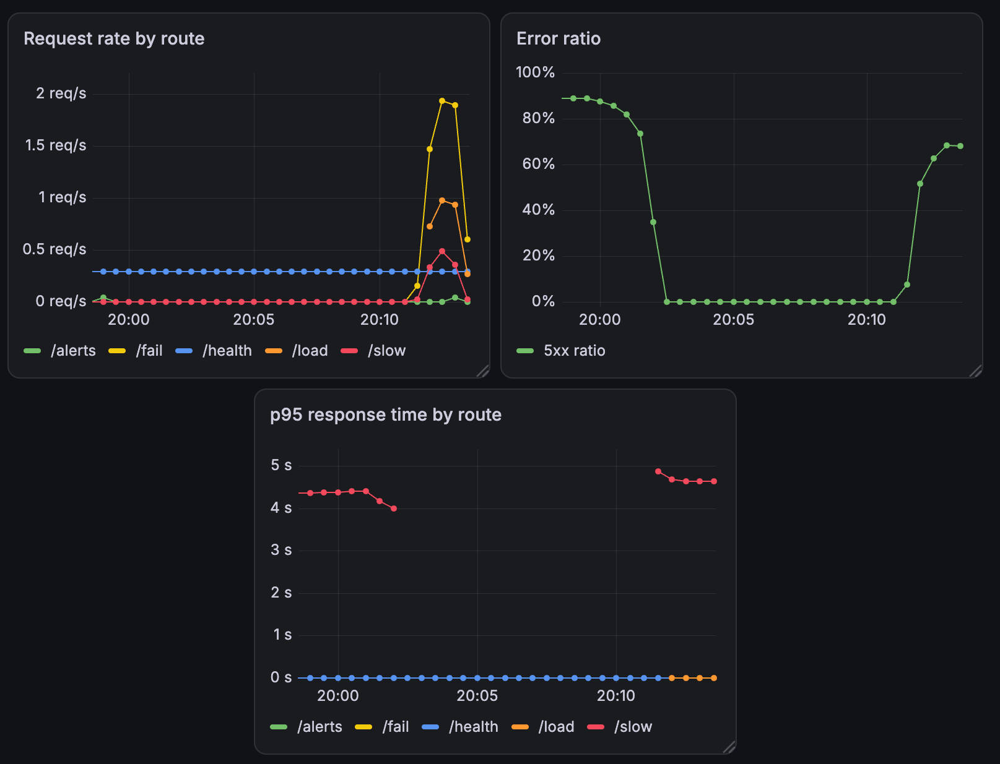
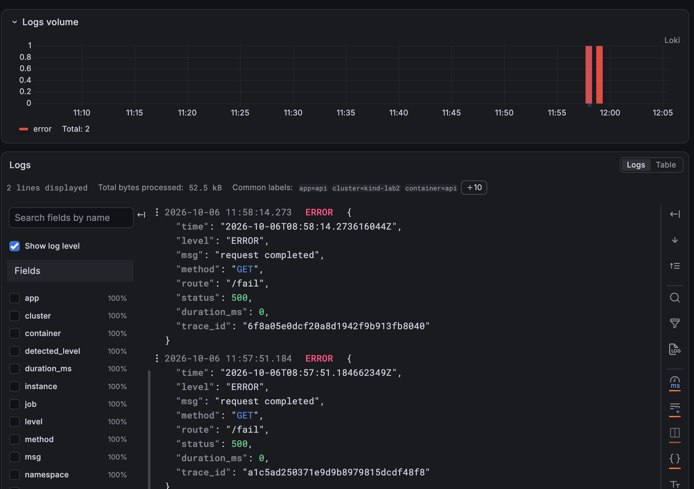
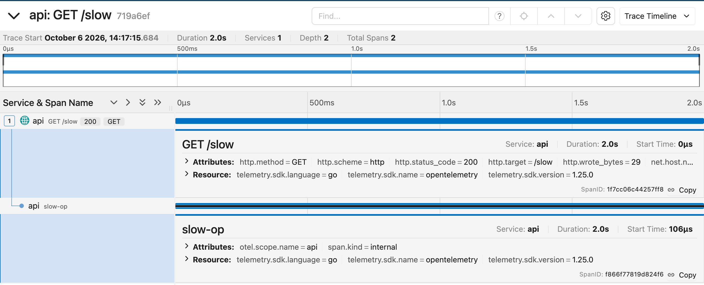
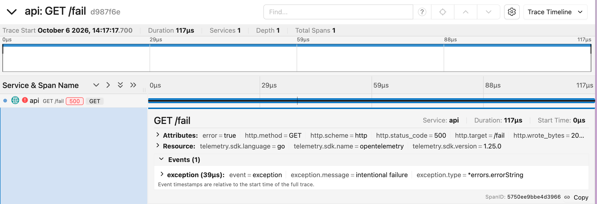
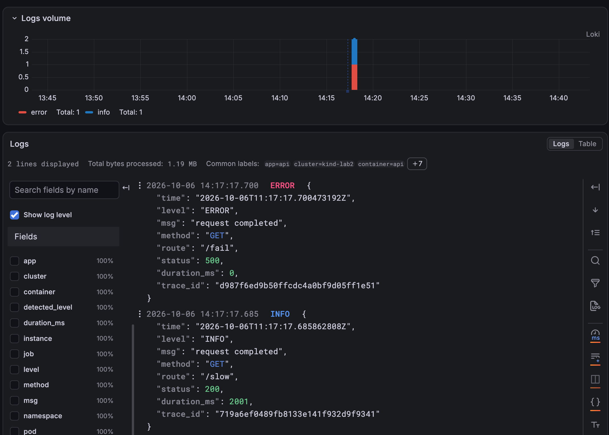
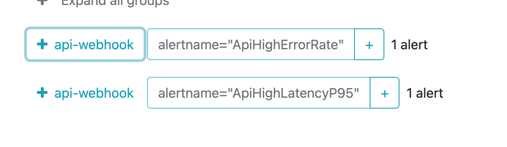
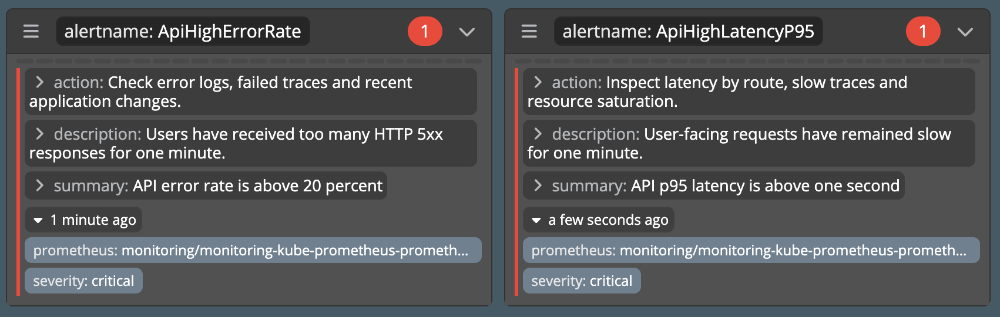
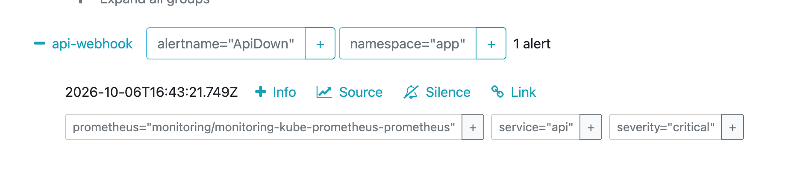
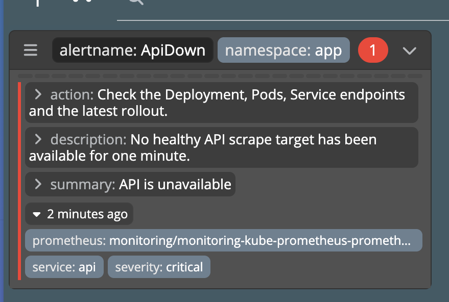

# Лаба 2

# Часть 0 -- Сервис API

Для лабы сделал небольшой сервис на Go.

```bash
curl http://localhost:8080/health          # ok
curl http://localhost:8080/fail            # намеренный 500
curl http://localhost:8080/slow            # спим от 1 до 3 секунд
curl 'http://localhost:8080/load?count=50' # 50 запросов к /health
curl http://localhost:8080/metrics         # метрики Prometheus
```

Для RED добавил три метрики:

```text
api_http_requests_total
api_http_errors_total
api_http_request_duration_seconds
```

Логи пишутся в stdout в JSON, в записи о запросе есть `trace_id`. На `/slow`
создаётся отдельный span `slow-op`, а на `/fail` текущий span помечается как
ошибочный. Это пригодится дальше, когда подключу Jaeger.

Образ собирается в два этапа.

```dockerfile
FROM golang:1.22-alpine AS build
...
RUN CGO_ENABLED=0 GOOS=linux go build -trimpath -ldflags="-s -w" -o /out/api .

FROM gcr.io/distroless/static-debian12:nonroot
COPY --from=build /out/api /api
USER 65532:65532
ENTRYPOINT ["/api"]
```

# Часть 1 -- Prometheus и Grafana

## Поднимаем Kubernetes

Кластер поднял через kind. Его нода работает как Docker-контейнер, а Pod внутри
неё запускает уже containerd.

```bash
qerenny@containers:~/containers-labs$ kubectl get nodes -o wide
NAME                 STATUS   ROLES           AGE   VERSION   INTERNAL-IP   EXTERNAL-IP   OS-IMAGE                       KERNEL-VERSION              CONTAINER-RUNTIME
lab2-control-plane   Ready    control-plane   20m   v1.37.0   172.18.0.2    <none>        Debian GNU/Linux 13 (trixie)   6.8.0-139-generic (amd64)   containerd://2.3.4
```

Приложение и мониторинг разнёс по разным namespace:

```bash
kubectl create namespace app
kubectl create namespace monitoring
```

Так проще отдельно управлять Helm-релизами и селекторами.

## Ставим стек мониторинга

Prometheus Operator, Prometheus и Grafana поставил одним релизом
`kube-prometheus-stack`:

```bash
helm upgrade --install monitoring \
  prometheus-community/kube-prometheus-stack \
  --version 89.2.0 \
  --namespace monitoring \
  --values lab2/helm/monitoring/values.yaml \
  --wait --timeout 10m
```

```bash
qerenny@containers:~/containers-labs/lab2$ helm list -n monitoring
NAME         NAMESPACE    REVISION  STATUS    CHART                         APP VERSION
monitoring   monitoring   1         deployed  kube-prometheus-stack-89.2.0  v0.93.1

qerenny@containers:~/containers-labs/lab2$ kubectl get pods -n monitoring
NAME                                                   READY   STATUS    RESTARTS
monitoring-grafana-5d8f6b678c-7wgb4                    3/3     Running   0
monitoring-kube-prometheus-operator-6869bbbf74-jjkhb   1/1     Running   0
monitoring-kube-state-metrics-6bf9f6c66f-28j2x         1/1     Running   0
monitoring-prometheus-node-exporter-dnmz5              1/1     Running   0
prometheus-monitoring-kube-prometheus-prometheus-0     2/2     Running   0
```

`ServiceMonitor` лежит в `app`, а Prometheus -- в `monitoring`. По умолчанию они
друг друга не видели бы, поэтому открыл поиск ServiceMonitor по всем namespace:

```yaml
serviceMonitorSelectorNilUsesHelmValues: false
serviceMonitorSelector: {}
serviceMonitorNamespaceSelector: {}
```

Для этой лабы нормально. В проде так широко оставлять не стоит: лучше выбирать
только доверенные namespace по меткам.

## Упаковываем API в Helm

Собрал образ и загрузил его внутрь kind-ноды:

```bash
cd lab2/api
go mod tidy
go test -race ./...
docker build -t lab2-api:local .

kind load docker-image lab2-api:local --name lab2
```

Обычного `docker build` здесь мало: Docker хоста и containerd внутри kind хранят
образы отдельно. Поэтому и нужен `kind load`.

Deployment, Service, ServiceMonitor и дашборд Grafana сложил в один локальный
chart:

```bash
helm upgrade --install api lab2/helm/api \
  --namespace app \
  --wait --timeout 5m
```

Получилась такая цепочка:

```text
ServiceMonitor.spec.selector в Service.metadata.labels
Service.spec.selector в Pod.metadata.labels
```

ServiceMonitor использует имя порта Service `http`, а не номер порта контейнера.

## Споткнулся о non-root

Первый Pod запускаться отказался:

```text
Error: container has runAsNonRoot and image has non-numeric user (nonroot),
cannot verify user is non-root
```

В образе был `USER nonroot`. Kubelet увидел строку и не смог проверить, что за
ней действительно стоит не UID 0.

Поменял пользователя на числовой UID/GID `65532` и явно указал его в PodSpec:

```yaml
securityContext:
  allowPrivilegeEscalation: false
  capabilities:
    drop: ["ALL"]
  readOnlyRootFilesystem: true
  runAsNonRoot: true
  runAsUser: 65532
  runAsGroup: 65532
```

После пересборки и повторного `kind load` Pod запустился:

```bash
qerenny@containers:~/containers-labs$ kubectl get pods,svc,servicemonitor -n app
NAME                       READY   STATUS    RESTARTS   AGE
pod/api-7b755b7d5d-gwdkc   1/1     Running   0          94s

NAME          TYPE        CLUSTER-IP     EXTERNAL-IP   PORT(S)    AGE
service/api   ClusterIP   10.96.14.176   <none>        8080/TCP   14m

NAME
servicemonitor.monitoring.coreos.com/api
```

## Проверяем scrape

ServiceMonitor создался, но этого мало: можно ошибиться в selector, порте или
пути. Проверил результат через Prometheus API:

```bash
curl -sG http://127.0.0.1:9090/api/v1/query \
  --data-urlencode 'query=up{namespace="app",service="api"}'
```

```json
{
  "status": "success",
  "data": {
    "resultType": "vector",
    "result": [{
      "metric": {
        "__name__": "up",
        "container": "api",
        "endpoint": "http",
        "instance": "10.244.0.15:8080",
        "job": "api",
        "namespace": "app",
        "pod": "api-7b755b7d5d-gwdkc",
        "service": "api"
      },
      "value": [1791199924.483, "1"]
    }]
  }
}
```

Target тоже оказался здоров:

```json
{
  "health": "up",
  "lastError": "",
  "scrapeUrl": "http://10.244.0.15:8080/metrics"
}
```

## RED dashboard

Дашборд положил в ConfigMap с label:

```yaml
grafana_dashboard: "1"
```

Sidecar Grafana подхватывает такие ConfigMap сам, поэтому импортировать JSON
через UI не пришлось.

RPS считаю через скорость изменения counter:

```promql
sum by (route) (rate(api_http_requests_total{route!="/metrics"}[1m]))
```

Доля ошибок -- скорость 5xx, делённая на скорость всех запросов:

```promql
100 *
(sum(rate(api_http_errors_total[5m])) or vector(0))
/
clamp_min(sum(rate(api_http_requests_total{route!="/metrics"}[5m])), 0.001)
```

p95 считаю из histogram buckets:

```promql
histogram_quantile(
  0.95,
  sum by (le, route) (
    rate(api_http_request_duration_seconds_bucket{route!="/metrics"}[5m])
  )
)
```

`le` здесь обязательно: это границы buckets. Без них квантиль уже не
посчитать.

Дал сервису обычный трафик, ошибки и медленные запросы одновременно. Все три
графика отреагировали: вырос RPS, появилась доля 5xx, а `/slow` отдельно вылез
на p95:



# Часть 2 -- Теперь еще и логи

Ну что же, метрики у нас уже есть, теперь надо куда-то складывать логи. Сам Loki
за ними ходить не будет, он только принимает и хранит. Поэтому сначала поднимем
его, а потом уже отправим к нему Alloy с пакетами логов.

Кластер у нас из одной ноды, значит и Loki делаем один в monolithic режиме:

```yaml
deploymentMode: Monolithic

loki:
  commonConfig:
    replication_factor: 1
  storage:
    type: filesystem

singleBinary:
  replicas: 1
  persistence:
    enabled: false
```

Хранилище пока `emptyDir`, удалим Pod - попрощаемся и с логами. Для лабы сойдет.

```bash
helm upgrade --install loki \
  grafana-community/loki \
  --version 18.5.0 \
  -n monitoring \
  -f lab2/helm/loki/values.yaml \
  --wait --timeout 10m
```

Типо даже запустилось, но через несколько минут Loki упал:

```text
joining memberlist cluster failed
failed to join 192.168.1.123:7946
exitCode=1
```

Оказалось, что он через memberlist ищет другие экземпляры Loki. У нас экземпляр
один, искать ему некого, поэтому ring оставляем в его же памяти и друзей больше
не ищем:

```yaml
commonConfig:
  replication_factor: 1
  ring:
    kvstore:
      store: inmemory

memberlistConfig:
  join_members: []
```

Теперь уже действительно живой:

```text
loki ready=true restarts=0
loki-sc-rules ready=true restarts=0
```

Проверим еще `/ready`, потому что `Running` у Pod не всегда означает, что внутри
всё хорошо:

```bash
qerenny@containers:~/containers-labs$ curl http://127.0.0.1:3101/ready
ready
```

## Кто-то же должен принести логи

Теперь к Alloy. Ставим его DaemonSet, чтобы на каждой ноде был свой сборщик и
забирал логи только со своей ноды.

Берем только namespace `app`. В labels оставляем `namespace`, `pod`, `container`,
`app` и `job`. `trace_id` в labels не добавляем, иначе почти на каждый запрос
получим новое значение и раздуем индекс. 

```bash
helm upgrade --install alloy \
  grafana/alloy \
  --version 1.12.1 \
  -n monitoring \
  -f lab2/helm/alloy/values.yaml \
  --wait --timeout 10m
```

С первого раза нас послали:

```text
.spec.template.spec.containers[name="alloy"].env:
duplicate entries for key [name="HOSTNAME"]
```

`HOSTNAME` я добавил руками, но chart уже сделал это за меня через
`spec.nodeName`. Убираем свой дубль и пробуем еще раз:

```text
daemonset.apps/alloy   1   1   1   1   1
pod/alloy-dwttp        2/2 Running 0
```

Alloy начал получать `404` и выкидывать логи после
ретраев.

```bash
qerenny@containers:~/containers-labs$ getent hosts loki-gateway.monitoring.svc.cluster.local
192.168.1.123 loki-gateway.monitoring.svc.cluster.local.home.arpa
```

Вместо Kubernetes Service мы чудесным образом пришли на `192.168.1.123`реверс прокси и
получили там OpenResty. Из-за `ndots:5` к имени дописался `home.arpa`. Добавим
точку в конец имени, чтобы оно сразу считалось полным:

```hcl
url = "http://loki-gateway.monitoring.svc.cluster.local./loki/api/v1/push"
```

Теперь `dropping data` исчез, а логи наконец появились в Loki.

С запросом я тоже сначала отличился и искал `intentional failure`. Только эта
строка была в ответе API, а в лог мы её вообще не писали. Ищем по полям JSON:

```logql
{namespace="app"} | json | route="/fail" and status=500
```

```json
{"level":"ERROR","msg":"request completed","method":"GET","route":"/fail","status":500,"duration_ms":0,"trace_id":"a1c5ad250371e9d9b8979815dcdf48f8"}
```

## Тащим всё это в Grafana

Datasource руками через UI добавлять не будем, лучше положим его в values
`kube-prometheus-stack`, чтобы после пересоздания Grafana ничего не повторять:

```yaml
additionalDataSources:
  - name: Loki
    uid: loki
    type: loki
    access: proxy
    url: http://loki-gateway
    isDefault: false
```

С `access: proxy` запрос отправляет сама Grafana внутри кластера, поэтому браузер
может ничего не знать про Kubernetes DNS.

```bash
qerenny@containers:~/containers-labs$ curl -s \
  -u "admin:$GRAFANA_PASSWORD" \
  http://127.0.0.1:3000/api/datasources/uid/loki/health | jq .
{
  "message": "Data source successfully connected.",
  "status": "OK"
}
```

Ну и дергаем пару раз `/fail`, идём в Explore и видим наши ошибки вместе с
`trace_id`. Логи официально выбрались из `kubectl logs`:



# Часть 3 -- Теперь ищем куда ушло время

Логи у нас уже есть, но по ним видно только что запрос был долгий. Почему он был
долгий будем смотреть в Jaeger. Ставим его одной репликой, потому что кластер у
нас всё ещё не стал продом за ночь:

```yaml
jaeger:
  replicas: 1

  resources:
    requests:
      cpu: 100m
      memory: 128Mi
    limits:
      memory: 512Mi
```

```bash
helm upgrade --install jaeger \
  jaegertracing/jaeger \
  --version 4.14.1 \
  -n monitoring \
  -f lab2/helm/jaeger/values.yaml \
  --wait --timeout 10m
```

Jaeger открыл нам целый склад портов, но нужны пока два: `4317` принимает OTLP
по gRPC, а на `16686` живёт UI.

```text
deployment.apps/jaeger   1/1   1   1
pod/jaeger-69668bb99f-s8h76   1/1   Running   0
service/jaeger   ClusterIP   4317/TCP,4318/TCP,16686/TCP,...
```

Сам сервис уже был обмазан OpenTelemetry, поэтому осталось только показать ему,
куда слать трейсы:

```yaml
otel:
  exporterEndpoint: "http://jaeger.monitoring.svc.cluster.local.:4317"
```

Точка в конце снова нужна, чтобы не улететь на home.arpa. 
После обновления `api` появился в списке сервисов Jaeger. Правда сначала я пошёл
в старый `/api/services` и получил `404`. В Jaeger 2.21 теперь API v3:

```bash
qerenny@containers:~/containers-labs$ curl -s \
  http://127.0.0.1:16686/api/v3/services | jq .
{
  "services": [
    "api",
    "jaeger"
  ]
}
```

## Медленно и больно

Дергаем `/slow` и `/fail`, после чего достаём их `trace_id` из Loki:

```text
/fail   500   d987f6ed9b50ffcdc4a0bf9d05ff1e51
/slow   200   719a6ef0489fb8133e141f932d9f9341
```

У `/slow` получилось два span: корневой `GET /slow` и наш вложенный `slow-op`.




У `/fail` span один, зато он честно помечен ошибкой. Внутри есть `500`,
`error=true` и событие exception с нашим `intentional failure`:



## Связываем Loki и Jaeger

Одинаковый `trace_id` лежит и в строке лога, и в Jaeger. Поэтому вместо гадания
по времени можно взять ID конкретного запроса и сразу открыть его трейс:



Сначала я добавил Jaeger как datasource Grafana, но он решил проверять старый
`/api/services` и снова получил `404`. Сам Jaeger при этом был полностью живой.
Спорить с версиями не стал и сделал ссылку прямо из derived field Loki в UI
Jaeger:

```yaml
derivedFields:
  - name: TraceID
    matcherRegex: '"trace_id":"([a-f0-9]+)"'
    url: 'http://127.0.0.1:16686/trace/$${__value.raw}'
    urlDisplayLabel: View trace
```

Теперь раскрываем лог, жмём `View trace` и попадаем ровно в тот запрос, который
нужен.

# Часть 4 -- Нельзя спать, алерт горит(

Круглосуточно сидеть перед графиками никто не будет.
Поэтому включим Alertmanager и отправим уведомления в webhook самого API:

```yaml
route:
  group_by: ['alertname', 'namespace']
  group_wait: 5s
  group_interval: 30s
  repeat_interval: 4h
  receiver: api-webhook

receivers:
  - name: api-webhook
    webhook_configs:
      - url: http://api.app.svc.cluster.local.:8080/alerts
        send_resolved: true
```

Для лабы такой receiver удобен: по JSON-логу сразу видно, что уведомление
дошло. В настоящем проекте сообщать API о смерти этого же API идея так себе(((((

С первого раза Alertmanager даже не создал Pod:

```text
undefined receiver "null" used in route
StatefulSetNotFound
```

Helm склеил мой конфиг с конфигом chart и оставил дефолтный маршрут на
несуществующий receiver `null`. Передал Alertmanager цельным `stringConfig`,
после чего Operator уже смог собрать StatefulSet:

```text
alertmanager.monitoring.coreos.com/monitoring-kube-prometheus-alertmanager   1   1   True   True
statefulset.apps/alertmanager-monitoring-kube-prometheus-alertmanager       1/1
pod/alertmanager-monitoring-kube-prometheus-alertmanager-0                  2/2   Running
```

Сначала отправил тестовый alert прямо в API Alertmanager. Ответ `200` означает,
что Alertmanager его принял, а доставку проверил уже по логам API:

```json
{"msg":"alertmanager notification","receiver":"api-webhook","status":"firing","alerts":[{"status":"firing","labels":{"alertname":"ManualWebhookTest","severity":"critical"}}]}
```

## Три причины проснуться

Правила положил в `PrometheusRule`. Prometheus подхватывает его из namespace
`app`, поэтому для правил, как и раньше для ServiceMonitor, открыл поиск по
namespace.

Первый alert -- API совсем пропал:

```promql
max(up{namespace="app",service="api"}) == 0
or absent(up{namespace="app",service="api"})
```

Здесь нужны обе половины. `up == 0` ловит найденный, но не скрейпящийся target,
а `absent(up)` -- случай, когда target вообще исчез. Для пользователя оба
варианта означают одно: сервис недоступен. Дежурному здесь надо проверить
Deployment, Pod, endpoints Service и последний rollout.

Второй alert -- больше 20% ошибок при заметном трафике:

```promql
sum(rate(api_http_errors_total{namespace="app"}[1m]))
/
clamp_min(sum(rate(api_http_requests_total{namespace="app",route!~"/(health|metrics|alerts)"}[1m])), 0.001)
> 0.2
```

К нему добавил условие RPS больше `0.1`, иначе одна случайная ошибка при почти
нулевом трафике устроит нам критичный инцидент. Если условие всё-таки держится
минуту, пользователи уже стабильно получают 5xx. Тогда идём в логи ошибок и
неуспешные трейсы, а заодно смотрим последние изменения приложения.

Третий -- p95 пользовательских запросов дольше секунды:

```promql
histogram_quantile(
  0.95,
  sum by (le) (
    rate(api_http_request_duration_seconds_bucket{namespace="app",route!~"/(health|metrics|alerts)"}[1m])
  )
) > 1
```

`le` оставляем, иначе схлопнем границы histogram buckets и p95 считать будет уже
не из чего. Такой alert означает, что медленными стали не отдельные выбросы, а
заметная часть пользовательских запросов. Дежурному надо разложить задержку по
route, открыть медленные трейсы и проверить, не упёрся ли Pod в ресурсы. Все три
условия должны держаться минуту, чтобы не будить дежурного из-за короткого
всплеска.

Нагрузил `/fail` и `/slow`, дождался `firing` и увидел оба alert в штатном UI:



После остановки нагрузки правила вернулись в `inactive`, а webhook получил
`resolved`. 

## Karma

Поверх Alertmanager поставил Karma отдельным локальным chart:

```bash
helm upgrade --install karma lab2/helm/karma \
  --namespace monitoring \
  --wait --timeout 5m
```

Она ничего не вычисляет и не рассылает, а только забирает состояние из
Alertmanager и показывает его человеческим списком:

```yaml
env:
  - name: ALERTMANAGER_URI
    value: http://monitoring-kube-prometheus-alertmanager.monitoring.svc.cluster.local.:9093
  - name: ALERTMANAGER_NAME
    value: lab2
  - name: ALERTMANAGER_PROXY
    value: "true"
```

Те же два alert видны и там:



Для `ApiDown` просто уменьшил Deployment до нуля. Prometheus увидел исчезнувший
target, а Alertmanager и Karma показали отдельный критичный alert:




